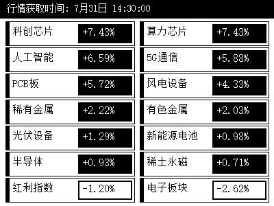

# 📟 Zectrix E-Ink Market Dashboard

<p align="left">
  
  
  
</p>

专为 **Zectrix 水墨屏** 打造的 A 股 / 科技板块 / 自选基金实时盘中看盘看板。

采用 **1-Bit Mode 1 纯单色调色板 + dither=false 0 噪点直通算法** 与 **精细宋体双列网格**，彻底解决水墨屏发糊与噪点问题，呈现出如真纸雕刻般黑白分明的极清看盘体验。

<p align="center">
  
</p>

---

## ✨ 核心特性

- ⚡ **实时盘中行情**：直连新浪财经 API，秒级抓取 14 大核心/自选板块盘中涨跌幅（自动降序排列）。
- 🖼️ **1-Bit 0 噪点直通**：跳过云端散点抖动算法，字迹黑白分明、锐利无噪点。
- ✍️ **精细宋体典雅排版**：内置精细宋体 (`fonts/simsun.ttc`)，呈现复古电子纸/纸质书卷感。
- ⏰ **交易日定时推送**：支持周一至周五 `09:00-15:00` 每小时整点及 `14:30` (尾盘决策点) 自动推屏。
- 🤖 **AI Skill 兼容**：包含标准 `SKILL.md` 指南，支持 Antigravity / Cursor / Claude 等 AI Agent 自动化调用。

---

## 🚀 快速开始

### 1. 安装依赖

```bash
pip install Pillow
```

### 2. 运行脚本

```bash
# 环境变量配置 (PowerShell / Linux)
$env:ZECTRIX_DEVICE_MAC="你的设备MAC地址"
$env:ZECTRIX_API_KEY="你的API_KEY"

# 运行单次推屏
python scripts/zectrix_push_eink.py

# 启动交易日定时自动推送 (守护进程)
python scripts/trading_day_scheduler.py
```

---

## 📁 目录结构

```text
.
├── SKILL.md                         # AI Agent 技能指南
├── fonts/
│   └── simsun.ttc                  # 内置精细宋体库 (跨平台开箱即用)
└── scripts/
    ├── zectrix_push_eink.py         # 核心渲染与直通推送脚本
    └── trading_day_scheduler.py     # 交易日定时推送守护进程
```

---

## 📄 License
[MIT License](LICENSE)
